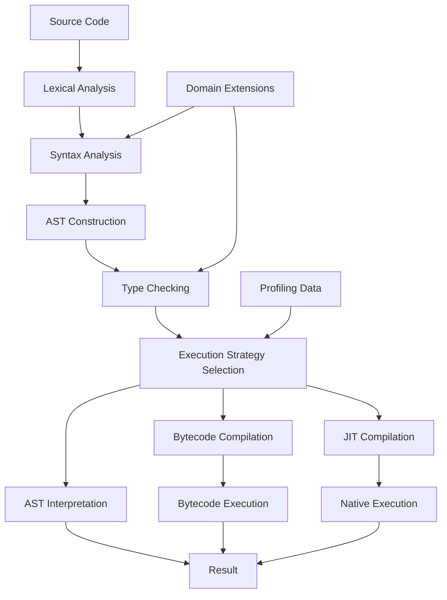

PADI Deliverable: Symbolic Programming Language

1. Planning Phase

1.1 Project Vision

Objective: Develop a high-level programming language that bridges mathematical notation with computational implementation through symbolic computation, pattern matching, and domain-specific abstractions.

1.2 Key Requirements

· Mathematical Expressiveness: Syntax closely mirrors mathematical notation
· Multi-Tiered Execution: AST interpretation, bytecode compilation, and JIT optimization
· Domain Extensibility: Pluggable architecture for mathematics, physics, finance domains
· Performance: Adaptive optimization with selective native code compilation
· Safety: Strong type system with runtime contracts and verification

1.3 Success Criteria

· Support for symbolic algebraic manipulation
· Seamless integration of domain-specific syntax
· Performance competitive with specialized mathematical software
· Extensible architecture for new domain integration

1.4 Project Scope

In Scope:

· Core language interpreter and compiler
· Symbolic computation engine
· Mathematical domain implementation
· Standard library and development tools

Out of Scope:

· IDE development (separate tooling)
· Cross-platform GUI applications
· Enterprise deployment systems

2. Analysis Phase

2.1 Technical Requirements Analysis

2.1.1 Language Core Requirements

· Pattern Matching System: Structural, type-based, and view patterns with guards
· Type System: Symbolic types, algebraic data types, gradual typing with inference
· Execution Model: Multi-tiered (interpreted → bytecode → JIT compiled)
· Concurrency: Structured concurrency with async/await support

2.1.2 Domain-Specific Requirements

· Mathematics: Symbolic algebra, calculus, equation solving
· Physics: Physical modeling, simulation constructs
· Finance: Quantitative finance types and operations
· Extensibility: Plugin architecture for new domains

2.1.3 Performance Requirements

· Startup Time: Immediate execution via AST interpreter
· Optimization: Adaptive hot-path detection and JIT compilation
· Memory Management: Efficient garbage collection with cycle detection
· Mathematical Performance: Optimized symbolic computation kernels

2.2 Risk Analysis

· Technical Complexity: Multi-language integration (Python/Cython/C++)
· Performance Optimization: Balancing interpretation speed vs. compilation overhead
· Domain Integration: Maintaining consistency across specialized syntaxes
· Tooling Maturity: Debugging and profiling for multi-tiered execution

2.3 Stakeholder Analysis

· Researchers: Need mathematical expressiveness and symbolic computation
· Developers: Require extensibility and performance
· Domain Experts: Need specialized syntax and semantics
· System Architects: Require clean integration and maintainability

3. Design Phase

3.1 System Architecture

3.1.1 High-Level Architecture

```
Symbolic Language Stack:
┌─────────────────────────────────────────┐
│            Domain Extensions            │
│    (Math, Physics, Finance, etc.)      │
├─────────────────────────────────────────┤
│           Standard Library              │
├─────────────────────────────────────────┤
│              Core Language              │
│  (Parser, Type System, Runtime)        │
├─────────────────────────────────────────┤
│          Multi-Tiered Runtime           │
│  (Interpreter, Bytecode VM, JIT)       │
├─────────────────────────────────────────┤
│        Language Infrastructure          │
│      (Python, Cython, C++ Layers)      │
└─────────────────────────────────────────┘
```

3.1.2 Execution Pipeline Design



3.2 Component Design

3.2.1 Core Language Components

Parser Subsystem:

· Recursive descent parser with error recovery
· Domain-aware lexical analysis
· AST generation with source mapping

Type System:

· Hindley-Milner type inference with extensions
· Symbolic type representation
· Gradual typing with dynamic checks
· Domain-specific type extensions

Pattern Matching Engine:

· Structural pattern decomposition
· Guard expression evaluation
· Exhaustiveness checking
· Custom pattern support

3.2.2 Runtime Components

Multi-Tiered Execution:

· AST Interpreter: Direct tree walking for rapid prototyping
· Bytecode Compiler: Optimized intermediate representation
· Bytecode VM: Stack-based execution with specialized ops
· JIT Compiler: LLVM-based native code generation

Memory Management:

· Generational garbage collection
· Cycle detection algorithm
· Weak reference support
· Custom allocators for mathematical objects

3.2.3 Domain Extension System

Plugin Architecture:

```python
class DomainPlugin:
    def extend_parser(self, parser: Parser) -> None:
        """Add domain-specific syntax rules"""
        
    def extend_types(self, type_system: TypeSystem) -> None:
        """Register domain-specific types and operators"""
        
    def extend_runtime(self, runtime: Runtime) -> None:
        """Add domain-specific runtime functionality"""
```

3.3 Interface Design

3.3.1 Language Syntax Design

```symbolic
# Pattern matching example
factorial(0) = 1
factorial(n) = n * factorial(n - 1) when n > 0

# Symbolic computation example
diff(x^2, x)  # Returns 2*x

# Domain-specific syntax (Mathematics)
∫(sin(x), x, 0, π)  # Returns 2

# Async/await example
async def fetch_data(url):
    response = await http.get(url)
    return parse(response)
```

3.3.2 API Design Principles

· Consistency: Uniform syntax across domains
· Composability: Language constructs work together seamlessly
· Extensibility: Clear extension points for new domains
· Performance: APIs designed for efficient implementation

3.4 Data Design

3.4.1 Core Data Structures

· AST Nodes: Typed abstract syntax tree with source locations
· Symbolic Expressions: Tree representation of mathematical expressions
· Type Representations: Rich type descriptors with constraints
· Bytecode Instructions: Optimized intermediate representation

3.4.2 Runtime Data Structures

· Virtual Machine Stack: Efficient value storage and manipulation
· Heap Objects: Garbage-collected runtime objects
· Symbol Table: Scoped symbol resolution
· Profile Data: Execution statistics for optimization

4. Implementation Phase

4.1 Development Approach

4.1.1 Technology Stack

· Python (3.9+): High-level orchestration and standard library
· Cython: Performance-critical components and C++ integration
· C++ (17): Virtual machine, memory management, JIT backend
· LLVM: Just-in-time compilation infrastructure

4.1.2 Development Methodology

· Incremental Implementation: Core features first, domains later
· Test-Driven Development: Comprehensive test suite
· Performance Benchmarking: Continuous performance monitoring
· Documentation: Inline documentation with examples

4.2 Implementation Roadmap

Phase 1: Core Language Foundation (Months 1-4)

· Basic lexer and parser implementation
· AST design and construction
· Simple AST interpreter
· Basic type system
· Core pattern matching

Phase 2: Advanced Features (Months 5-8)

· Bytecode compiler and VM
· Advanced type inference
· Garbage collection system
· Standard library foundation
· Basic mathematical domain

Phase 3: Performance Optimization (Months 9-12)

· JIT compilation integration
· Performance profiling system
· Memory optimization
· Concurrent execution support
· Advanced pattern matching

Phase 4: Domain Extensibility (Months 13-16)

· Plugin system architecture
· Mathematics domain completion
· Physics domain implementation
· Finance domain implementation
· Development tools (REPL, debugger)

Phase 5: Polish and Optimization (Months 17-20)

· Performance tuning
· Comprehensive testing
· Documentation completion
· Community building

4.3 Quality Assurance

4.3.1 Testing Strategy

· Unit Tests: Individual component testing
· Integration Tests: Cross-component functionality
· Performance Tests: Execution speed and memory usage
· Domain Tests: Domain-specific functionality verification
· Compatibility Tests: Cross-platform compatibility

4.3.2 Code Quality Measures

· Static Analysis: Type checking and linting
· Code Review: Peer review of all changes
· Documentation Standards: Comprehensive inline documentation
· Performance Monitoring: Continuous benchmarking

4.4 Deployment Strategy

4.4.1 Distribution Methods

· Source Distribution: For developers and customization
· Binary Packages: Pre-compiled for major platforms
· Package Managers: Integration with pip, conda, etc.
· Docker Images: Containerized deployment

4.4.2 Development Tools

· Interactive REPL: Read-eval-print loop for exploration
· Debugger: Source-level debugging support
· Profiler: Performance analysis tools
· Language Server: IDE integration support

4.5 Success Metrics

4.5.1 Technical Metrics

· Performance: Mathematical operations within 2x of specialized systems
· Startup Time: <100ms for basic interpretation
· Memory Usage: Efficient garbage collection with minimal overhead
· Reliability: 99% test coverage with comprehensive error handling

4.5.2 Adoption Metrics

· Domain Coverage: Support for 3+ major computational domains
· Extension Ecosystem: Community-contributed domain plugins
· Documentation Quality: Comprehensive guides and examples
· Community Engagement: Active issue reporting and contributions

---

Appendix A: Risk Mitigation Strategies

Technical Risks

· Multi-language Integration: Regular integration testing and clear interface boundaries
· Performance Optimization: Profiling-driven development with fallback to simpler implementations
· Domain Complexity: Incremental domain implementation with user feedback

Project Risks

· Scope Creep: Strict adherence to phased implementation plan
· Resource Constraints: Focus on core functionality before advanced features
· Adoption Challenges: Early engagement with potential users and domain experts

Appendix B: Resource Requirements

Development Team

· Language Design Lead: Programming language design expertise
· Compiler Engineer: Compiler construction and optimization
· Runtime Systems Engineer: Virtual machine and memory management
· Mathematical Domain Expert: Symbolic computation and algebra
· Software Engineer: Standard library and tooling

Infrastructure

· Development Workstations: High-performance computing resources
· CI/CD Pipeline: Automated testing and performance benchmarking
· Documentation Hosting: Accessible documentation platform
· Community Infrastructure: Issue tracking and communication channels

