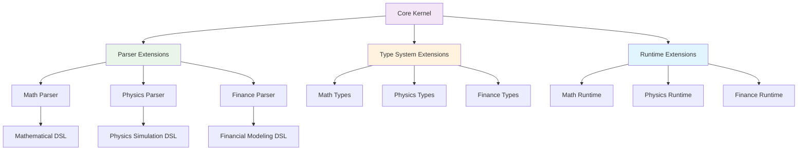

# 🧮 Symbolic
**A High-Performance Interpreted Language for Mathematical Expression and Symbolic Computation**


---

> **Note**: The main Symbolic repository is private. This showcase provides a technical overview of its architecture and capabilities without exposing proprietary code.

---

## 🎯 Elevator Pitch

**Symbolic** is a sophisticated, high-level interpreted programming language engineered for mathematical expressiveness and symbolic computation. Built with a multi-tiered execution engine that seamlessly transitions from rapid AST interpretation to bytecode compilation and JIT-optimized native code, Symbolic combines the flexibility of dynamic languages with the performance of compiled systems. Its pluggable domain architecture enables specialized extensions for mathematics, physics, finance, and other computational domains, making it a powerful platform for both research and production mathematical computing.

---

## ✨ Key Features

### 🔤 **Language Features**
- **Advanced Pattern Matching**: Structural pattern matching with guards, algebraic data types, and symbolic pattern decomposition
- **Symbolic Type System**: First-class symbolic types with algebraic manipulation and mathematical reasoning
- **Gradual Typing**: Optional static typing with sophisticated type inference and gradual migration support
- **Algebraic Data Types**: Rich ADT support with pattern matching and exhaustiveness checking
- **DSL Integration**: Embedded domain-specific language support with custom syntax extensions

### ⚡ **Execution Engine**
- **Multi-Tiered Architecture**: Seamless execution across AST interpretation, bytecode compilation, and JIT compilation
- **Dynamic JIT Compilation**: `@jit` directive for automatic hot-path optimization to native code
- **Structured Concurrency**: Built-in async/await with structured concurrency primitives
- **Memory Management**: Sophisticated garbage collection with cycle detection and weak references
- **Performance Profiling**: Integrated profiler with execution path analysis and bottleneck identification

### 🔧 **Extensibility & Domains**
- **Pluggable Domain System**: Modular architecture supporting domain-specific extensions
- **Mathematical Computing**: Advanced symbolic algebra, calculus, and numerical computation
- **Physics Simulation**: Specialized constructs for physical modeling and simulation
- **Financial Modeling**: Domain-specific types and operations for quantitative finance
- **Rich Standard Library**: Comprehensive stdlib with collections, I/O, networking, and utilities

---

## 🏗️ Architecture Deep Dive

Symbolic's architecture is designed around a flexible, multi-tiered execution model that balances development velocity with runtime performance. The system employs a sophisticated compilation pipeline that can dynamically choose the most appropriate execution strategy based on code characteristics and performance requirements.

### Execution Pipeline

```mermaid
graph TD
    A[Source Code] --> B[Lexer]
    B --> C[Parser]
    C --> D[AST]
    
    D --> E[AST Interpreter]
    D --> F[Bytecode Compiler]
    D --> G[JIT Compiler]
    
    F --> H[Bytecode VM]
    G --> I[Native Code]
    
    E --> J[Result]
    H --> J
    I --> J
    
    K[@jit Directive] --> G
    L[Hot Path Detection] --> G
    
    style D fill:#e1f5fe
    style G fill:#fff3e0
    style I fill:#e8f5e8
```

**Pipeline Components:**
- **Lexer/Parser**: Custom-built recursive descent parser with error recovery and position tracking
- **AST**: Rich abstract syntax tree with type annotations and metadata preservation
- **AST Interpreter**: Direct tree-walking interpreter for rapid prototyping and debugging
- **Bytecode Compiler**: Generates optimized bytecode with constant folding and dead code elimination
- **Bytecode VM**: Stack-based virtual machine with specialized mathematical operations
- **JIT Compiler**: LLVM-backed just-in-time compilation for performance-critical code paths

### Domain Plugin System



**Domain Architecture:**
- **Core Kernel**: Provides the foundational AST nodes, type system primitives, and execution infrastructure
- **Parser Extensions**: Domain-specific syntax extensions that integrate seamlessly with the core grammar
- **Type System Extensions**: Custom types, operators, and type checking rules for specialized domains
- **Runtime Extensions**: Performance-optimized implementations of domain-specific operations and algorithms

---

## 🛠️ Technical Stack

### **Python** (Orchestration & High-Level Logic)
- **Compiler Orchestration**: Manages the entire compilation pipeline from parsing to code generation
- **AST Manipulation**: Implements tree transformations, optimizations, and analysis passes
- **Core Interpreter**: Provides the reference implementation for language semantics
- **Standard Library**: Implements the majority of built-in functions and data structures
- **Development Tools**: Debugging, profiling, and introspection utilities

### **Cython** (Performance Bridge Layer)
- **Type Checker Core**: High-performance implementation of type inference and constraint solving algorithms
- **Performance-Critical Evaluator**: Optimized implementations of hot-path evaluation routines
- **C++ Integration**: Seamless binding layer between Python orchestration and C++ performance cores
- **Memory Management**: Efficient data structure implementations with manual memory control
- **Mathematical Kernels**: Optimized implementations of symbolic algebra and numerical routines

### **C++** (High-Performance Core)
- **Virtual Machine**: Core bytecode interpreter with optimized instruction dispatch
- **Memory Management**: Custom allocators, garbage collection, and object lifecycle management
- **Built-in Functions**: Performance-critical implementations of mathematical and system functions
- **JIT Backend**: Integration with LLVM for dynamic code generation and optimization
- **Concurrency Runtime**: Thread pools, schedulers, and synchronization primitives

---

## 📁 Project Structure Overview

The Symbolic codebase follows a carefully architected modular design that separates concerns and enables independent development of core systems:

- **`kernel/`** - Contains the foundational language runtime, including the core AST node definitions, basic type system, and execution engine interfaces. This is the heart of the language implementation.

- **`parsing/`** - Houses the complete lexical analysis and parsing infrastructure, including the tokenizer, recursive descent parser, error recovery mechanisms, and AST construction utilities.

- **`runtime/`** - Implements the multi-tiered execution system, containing the AST interpreter, bytecode compiler and VM, JIT compilation interface, and memory management subsystems.

- **`domains/`** - Contains the pluggable domain extension system, with specialized modules for mathematics (`math/`), physics (`physics/`), finance (`finance/`), and the domain plugin loading infrastructure.

- **`stdlib/`** - Provides the comprehensive standard library implementation, including collections, I/O operations, networking, mathematical functions, and utility modules.

- **`tests/`** - Comprehensive test suite covering unit tests, integration tests, performance benchmarks, and domain-specific test cases.

- **`tools/`** - Development and debugging utilities, including the interactive REPL, performance profiler, syntax highlighter, and language server implementation.

This structure reflects a deep understanding of compiler architecture, enabling clear separation between language specification, implementation, and extension mechanisms.

---

## 🚀 Performance Philosophy

Symbolic is designed with a **"start fast, optimize selectively"** philosophy that prioritizes both development velocity and runtime performance:

- **Immediate Execution**: Code runs immediately through the AST interpreter, enabling rapid prototyping and debugging
- **Adaptive Optimization**: The system automatically profiles execution patterns and promotes hot paths to more efficient execution tiers
- **JIT Integration**: The `@jit` directive provides explicit control over compilation to native code for performance-critical sections
- **Memory Efficiency**: Sophisticated garbage collection with generational collection and cycle detection minimizes memory overhead
- **Symbolic Optimizations**: Mathematical expressions undergo algebraic simplification and symbolic optimization before execution

This approach ensures that Symbolic code runs efficiently whether it's being used for interactive exploration or production mathematical computing workloads.

---

## 🎯 What This Demonstrates

This project showcases expertise across multiple domains of advanced software engineering and scientific computing:

- **Programming Language Design & Implementation** - Complete interpreter implementation with innovative multi-domain parser architecture
- **Multi-Domain Scientific Computing** - Integration of mathematics, chemistry, physics, biology, finance, astronomy, and geography domains
- **Advanced Parser Architecture** - Sophisticated recursive descent parser with domain-specific sub-parsers and seamless syntax integration
- **Systems Architecture & Design** - Multi-tiered execution engine with strategic performance optimization
- **Performance Engineering** - Profile-guided optimization with selective Cython/C++ integration for critical operations
- **Cross-Language Integration** - Seamless coordination between Python, Cython, and C++ components
- **Type System Design** - Advanced type inference, gradual typing, and domain-specific type systems
- **Algorithm Design** - Pattern matching engines, symbolic algebra, and multi-domain computational algorithms
- **Software Architecture** - Modular design with clear separation of concerns and domain extensibility
- **Scientific Domain Expertise** - Deep understanding of computational requirements across multiple scientific disciplines
- **API Design** - Elegant domain-specific syntax design and cross-domain interoperability
- **Testing & Quality Assurance** - Comprehensive test coverage across multiple domains and execution tiers

---

## 📜 License

The core Symbolic project is licensed under the **AGPL-3.0** license. This showcase repository is provided for demonstration and portfolio purposes only.

---

## 📞 Contact

**Elijah Manda**  
📧 [elijahmandajc@gmail.com](mailto:elijahmandajc@gmail.com)

For inquiries about collaboration, consulting, or technical discussions about advanced programming language implementation.
